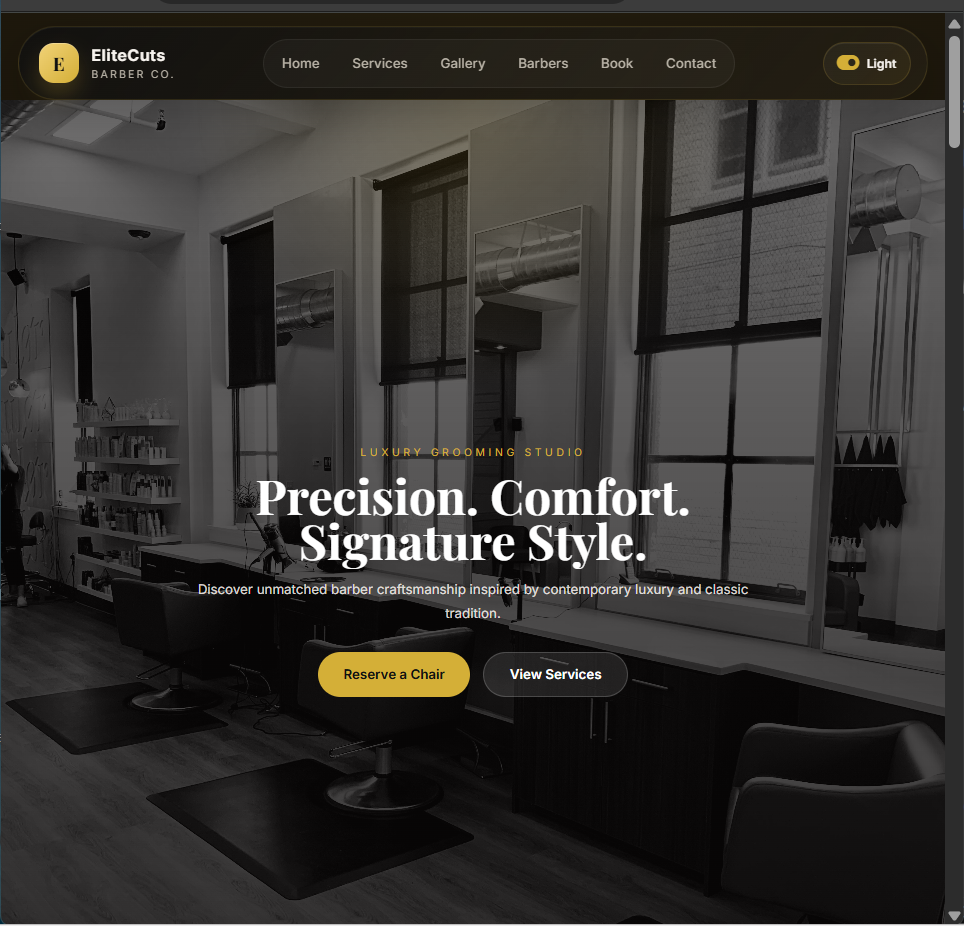
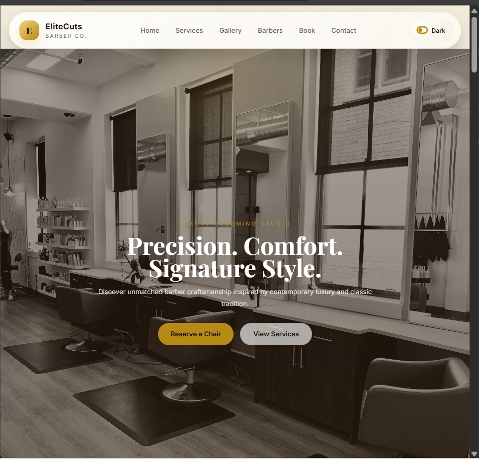

# EliteCuts Barber Co.

[](https://developer.mozilla.org/docs/Web/HTML)
[](https://developer.mozilla.org/docs/Web/CSS)
[](https://developer.mozilla.org/docs/Web/JavaScript)
[](#responsive-design)
[](#theme-system)
[](#license)

A modern luxury barber landing page built with plain HTML, CSS, and JavaScript.

This project is a responsive one-page website for a premium barber brand. It includes a polished hero section, service highlights, treatment menu, gallery, team showcase, booking form, studio slider, testimonials, contact section, theme toggle, and branded favicon support.

## Live Demo

- Demo URL placeholder:[https://elitecutsbarberco.vercel.app/]

## Screenshots

### Dark Mode



### Light Mode



## Preview

EliteCuts is designed to feel upscale and clean. The UI combines:

- A floating luxury navbar
- Dark and light theme support
- Smooth reveal-on-scroll animations
- A responsive image slider
- Animated counters
- A premium booking section
- Social links and branded footer

## Tech Stack

- `HTML5`
- `CSS3`
- `Vanilla JavaScript`
- `Font Awesome 6.6.0` for the theme toggle icon
- `Google Fonts`
  - `Inter`
  - `Playfair Display`

## Project Structure

```text
barber/
|- docs/
|  \- screenshots/
|     |- dark-mode-preview.svg
|     \- light-mode-preview.svg
|- favicon.ico
|- favicon.svg
|- index.html
|- README.md
|- script.js
|- style.css
\- img/
   |- barbbing.jpg
   |- before_after.jpg
   |- chairwithmirror.jpg
   |- clipper.jpg
   |- haircut1.jpg
   |- haircut2.jpg
   |- haircut3.jpg
   |- haircut4.jpg
   |- hairdyecolor.jpg
   |- happyclient.jpg
   |- happyclient1.jpg
   |- happyclient2.jpg
   |- salon.jpg
   |- salonblack.jpg
   |- salonchair.jpg
   |-screenshot_dark.png
   |-screenshot_light.png
   |- shopwhite.jpg
   |- washing_base_hairdresser.jpg
   \- washingbase2.jpg
```

## Features

### Layout and Sections

- Sticky luxury navbar
- Full-screen hero banner
- Services section
- Offerings and pricing menu
- Gallery section
- Barber/team section
- Booking form
- About/story section
- Studio image slider
- Animated stats section
- Testimonials section
- Contact call-to-action
- Footer with social icons and studio hours

### Interactions

- Smooth scrolling navigation
- Mobile navigation toggle
- Dark/light theme switch with saved preference in `localStorage`
- Reveal animations on scroll using `IntersectionObserver`
- Animated counters when stats enter the viewport
- Manual image slider with:
  - left/right controls
  - dot navigation
  - keyboard arrow navigation

### Branding

- Custom `E` browser favicon in:
  - `favicon.svg`
  - `favicon.ico`
- Luxury brand mark in the navbar
- Gold-accented visual identity

## Main Files

### `index.html`

Contains the full page structure:

- page metadata
- external font and icon links
- navbar
- all content sections
- footer

### `style.css`

Contains all visual styling:

- color variables
- dark/light theme variables
- layout system
- section styling
- navbar styling
- responsive behavior
- slider styling
- booking option styling
- footer styling

### `script.js`

Handles client-side interactions:

- theme switching
- `localStorage` theme persistence
- mobile nav open/close
- scroll progress bar
- reveal animations
- counter animation
- slider controls
- booking button alert

## Responsive Design

The layout is built to adapt across desktop, tablet, and mobile.

Responsive behavior includes:

- collapsing nav into a mobile menu
- stacked grid layouts on smaller screens
- mobile-friendly booking options
- responsive testimonials and team cards
- adaptive footer layout
- reduced navbar content spacing on smaller screens

## Theme System

The theme toggle is controlled by:

- button: `#theme-toggle`
- icon: `#theme-icon`
- body class: `.light-theme`

Behavior:

- default theme is dark
- clicking the toggle switches between dark and light
- the selected theme is stored in `localStorage`
- the Font Awesome toggle icon updates between on/off states

## Favicon Support

The project includes two favicon formats for stronger browser support:

- `favicon.svg`
- `favicon.ico`

Both are referenced in the `<head>` of `index.html`.
Browsers often cache favicons aggressively.

## Prerequisites

- Any modern browser (Chrome, Edge, Firefox, Safari)
- No build tools or dependencies needed

## Accessibility Notes

The project includes several accessible patterns:

- `aria-label` on controls
- semantic sectioning
- alt text on images
- keyboard slider controls
- visible button labels

Possible future improvements:

- add stronger focus-visible styles
- add form validation feedback
- improve reduced-motion handling
- add skip links

## Recommended Next Improvements

- Connect the booking form to a real backend or form service
- Add active nav state based on scroll position
- Add better form validation and success UI
- Add automatic slider playback with pause on hover
- Improve SEO metadata and Open Graph tags
- Add a real map embed for the location section

## Development Notes

- The site is intentionally dependency-light and easy to edit.
- No framework or bundler is required.
- Most updates can be made directly in `index.html` and `style.css`.
- Favicon caching can make icon updates appear delayed.

## License

This project currently `LICENSE` under MIT.

## Authoring Note

- Built by layo frontend developer

This README reflects the current project state in this folder, including:

- responsive navbar styling
- dark/light mode toggle
- slider functionality
- social footer icons
- custom favicon support
- preview assets for dark and light mode
